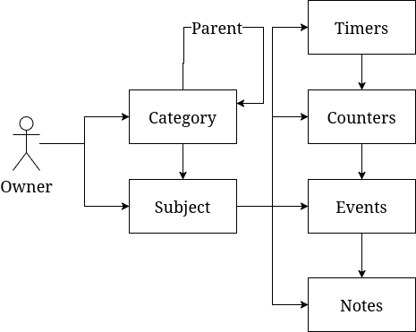

# Tracking Model

Track everything your little OCD heart desires.

## Logical Model

[](https://viewer.diagrams.net/?tags=%7B%7D&lightbox=1&highlight=0000ff&edit=_blank&layers=1&nav=1&title=Untitled%20Diagram.drawio#R%3Cmxfile%3E%3Cdiagram%20name%3D%22Page-1%22%20id%3D%22my9yOeuXcDj7VT8MVoF0%22%3E7VnbcpswEP0aP6aDuITkMXXc9iFpMnWmTfqmgALKAMuIxZh%2BfUUR99h1Wreyp32CPaxue86uBMysebx%2BL2gaXoPPoplp%2BOuZdTkzTUIcS14qpKyRszO7BgLBfeXUAUv%2BjSnQUGjOfZYNHBEgQp4OQQ%2BShHk4wKgQUAzdniAajprSgE2ApUejKfqF%2BxiqVThGh39gPAibkYmhnsS0cVZAFlIfih5kLWbWXABgfRev5yyqgtfEpW73bsPTdmKCJbhLA%2FQWVzefFm5ws%2Fr89e48cO%2BK65NTNTcsmwUzX65fmSAwhAASGi069K2APPFZ1ashrc7nCiCVIJHgM0MsFZk0R5BQiHGkntZjVgNtXIqCMsiFx7bMv5EEFQHDLX5mG3CpVAYxQ1HKdoJFFPlqOA%2BqJBO0fl1U5Y0K7CuC3ChgRaNcDXVbr1VD8OWworzvGw9VZ29Mp7Ev16r32iqVpYE18jJrqricyEkTx6372plJ1d0t8Cr%2BTV%2FWueJIlSliG8Mu6rmqVp0eLoSgZc8trRyyLeMYo3HIKGkn%2FuS3%2FN2fuI%2BW%2FUp34jij5KjjMWrdBAeenjKGs3E6tcz%2BeoaRSYLNKbIAVPL2U2yYQEXIkS1T%2BkOuhdzCXqpUKyaQrberfqNKTXuDsopuOyFNhQh7W8npSIF7K0eu1rJjDMvOX6w65o5Vx9K5V5xpIWfN8b5336NGWh0zlVH2aToOQm2dhJ7%2Fz7at5Dg6ySFazr9HxA4xdNJjTrb1Zf74XL3mHdqubmrf1a1JrD4Cskx7pOxRpCxHd6SIoyPp95i89lEkrz0R5FzGEJk4PE3qP5MT%2B8g16RzDWcyZSPKOx4coSO16bHnXdDDqzkIPg6PQn%2F80ZewoZK1vic0se0perJj68nRQStYvZaLnlVr%2FGZ%2B4u54TtEr5X31B3pkeUys97qTS3BQJExPSspCm1W0eRxcegpDBqgoJ9yQr9JFFt5Bx5JBIl0dAhLjncBHxoHqAMCpIkGPEEzZvf%2B4Z%2B6lSzWf09gDoTquUtZ8iJc3uH1%2F9vbv7U2otvgM%3D%3C%2Fdiagram%3E%3C%2Fmxfile%3E)

### Owner

An owner is the individual or group that owns a category and subject.

### Category

Categories are the top-level groupings of subjects. They can have parents optionally to create a hierarchy.

### Subject

Subjects are the individual items that are tracked. They must have a category.

### Note

Subjects contain notes, which are dated.

### Counter

Subjects can have counters for measurements. Each click of a counter is (can be) an event.

### Timer

Timers are counters with durations attached to them for when the counter needs to be clicked.

### Events

Events are clicked counters or just attached to subjects. They are effectively broader notes.